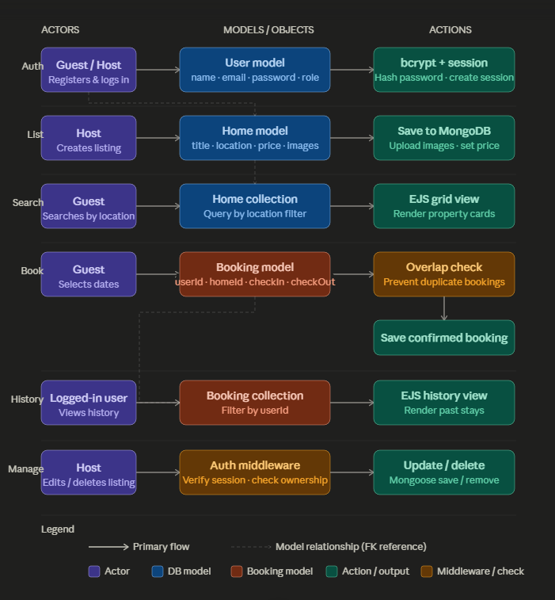
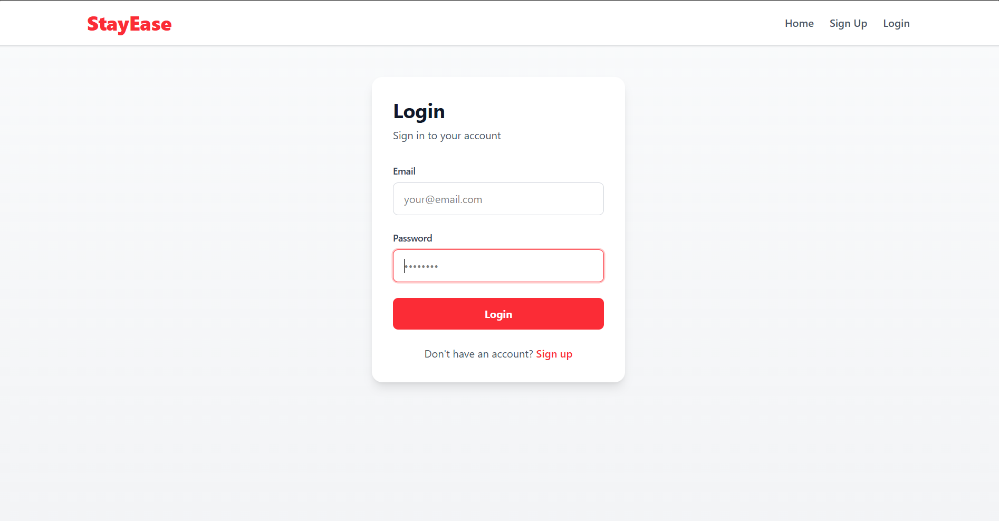
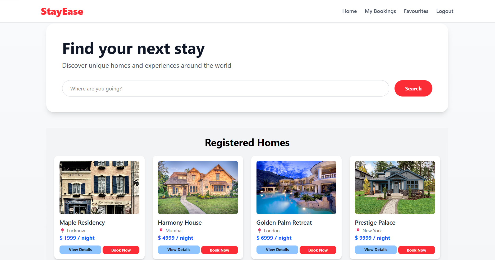
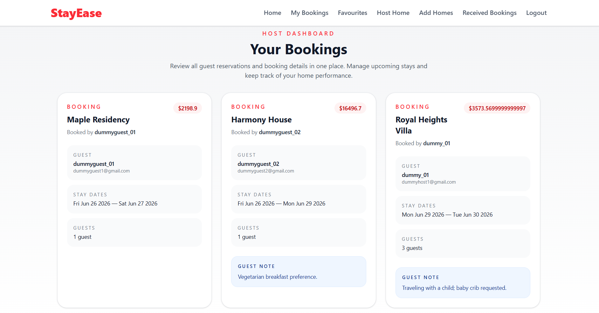
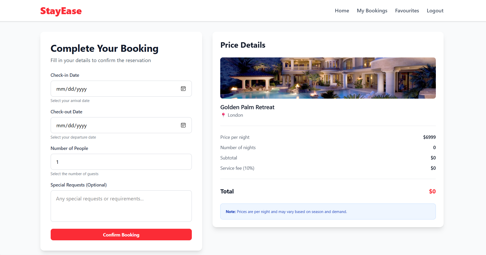

# StayEase-Booking-Platform
StayEase is a full-stack web application that allows users to browse, list, and book rental properties such as homes, apartments, and vacation stays.

The platform is inspired by Airbnb and focuses on providing a smooth booking experience with user authentication, property listings, and secure reservation management.

It is built using Node.js, Express.js, MongoDB, and EJS for server-side rendering.

 ## Key Features

 ###  User Features

- User registration and login system  
- Secure authentication using sessions / bcrypt  
- View available property listings  
- Search and explore properties by location  
- Book a property for selected dates  
- View booking history  

##  Property Features

- Add new property listings (host feature)  
- Edit or delete own listings  
- Upload property images  
- Add price, location, and description  
- View all listed properties in a grid layout  

##  Booking System

- Select check-in and check-out dates  
- Prevent duplicate or invalid bookings  
- Real-time availability handling  
- Store booking details in MongoDB database  


##  Extra Features

- Favorites / Wishlist system  
- Flash messages / alerts  
- Input validation for forms  
- Duplicate booking prevention logic  
- Responsive UI design  


##  Tech Stack

###  Frontend
- HTML  
- CSS / Tailwind CSS  
- EJS (Embedded JavaScript Templates)  

###  Backend
- Node.js  
- Express.js  

###  Database
- MongoDB  
- Mongoose ODM  

###  Authentication & Security

A secure authentication system has been implemented to ensure safe user access and data protection.

- Passwords are securely hashed using bcrypt before storage
- Session-based authentication maintains user login state
- Middleware is used to protect sensitive routes
- Only authenticated users can access booking and profile-related features
- Unauthorized access attempts are redirected to the login page


##  How to Run the Project Locally

Follow these steps to set up and run the project on your local machine.

### 1. Clone the Repository
```bash
git clone https://github.com/Ankit-git04/StayEase-Booking-Platform.git
```

### 2. Go to Project Directory
```bash
cd stayease 
 ```

### 3. Install Dependencies
```bash
npm install
```
### 4. Setup Environment Variables

Create a .env file in the root directory:
Then add the following variables:

```bash
MONGODB_URI=your_mongodb_connection_string
SESSION_SECRET=your_secret_key
```
### 5. Start the Server
```bash
npm start
```

### 6. Open in Browser
```bash
http://localhost:3000
```

## WorkFlow
 


##  Screenshots

###  Login Page


###  Home Page


###  Host Dashboard


###  Booking Form
